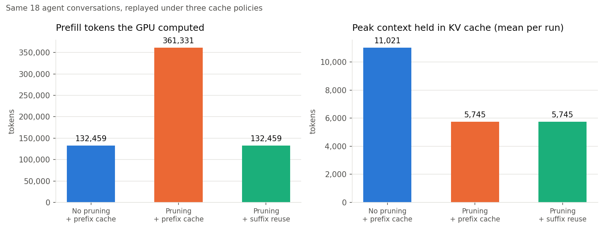
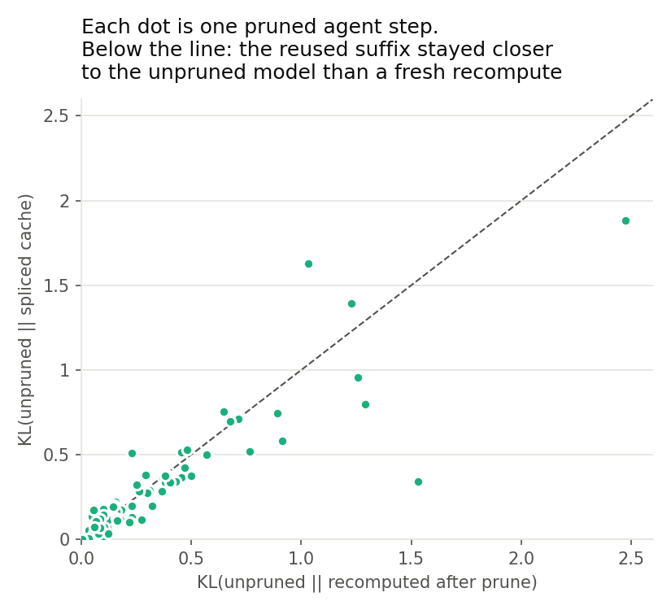

# threadcut

**A mini Subconscious Cache on a free Kaggle T4.** I built a small inference engine that prunes a
coding agent's working memory mid-run and reuses the KV cache on both sides of the cut, so the
suffix after a pruned span is shifted into place instead of re-encoded. Then I ran the Pi coding
agent on it and measured what that saves, what it breaks, and what the reused suffix "remembers"
about the tokens that were cut.

This is my reproduction, at toy scale, of the idea behind Subconscious's OrangeLine runtime
(Subconscious Cache plus Auto Compaction) and the TIM paper
([Luo et al., 2025](https://arxiv.org/abs/2507.16784)). It is not their code; everything here is
written from their public descriptions.

## Results

### 1. Pruning on a normal prefix cache costs more than not pruning. Suffix reuse makes it free.



I recorded 36 real Pi agent conversations with Qwen3-4B on a Kaggle T4 (6 bug-fixing tasks x 3
modes x 2 runs, 1,847 agent steps). Then I replayed each conversation under three cache policies,
using the engine's exact rules. Replaying each run with the configuration it was recorded under
reproduces the measured traces for all 36 runs, token for token (`experiments/validate_replay.py`).

| Policy | Tokens in prompts | Tokens computed (prefill) | vs. no pruning | Est. prefill time (T4) | Mean peak context |
|---|---|---|---|---|---|
| No pruning + prefix cache | 27,067,008 | 320,162 | 1.00x | 543 s | 14,336 |
| Pruning (k=1) + prefix cache | 13,769,130 | 965,414 | **3.02x** | 1,046 s | 7,716 |
| Pruning (k=1) + suffix reuse | 13,769,130 | 319,415 | **1.00x** | 542 s | 7,716 |

- Pruning halves the context the model attends to and the KV memory it holds. On a standard
  prefix cache, though, every prune invalidates everything after the cut, so the GPU re-prefills
  **3x more tokens than if the agent had never pruned at all**. This is the problem Subconscious
  describes, and here it is measured.
- With suffix reuse, the engine computes only the tokens that are new at each step, the same as
  an append-only agent. **The prune is free in prefill, and the context stays half the size.**
- In a single live run, suffix reuse served 98.7% of a 189-step agent's 2.2M prompt tokens from
  cache (27,893 computed). That run eventually looped and timed out; a looping agent re-sends
  near-identical context, which flatters hit rates, so the replay table above is the fair number.
- A side effect I did not plan for: suffix matching also repairs cache misses that the agent
  harness causes. In one unpruned run, the agent re-sent a tool call re-serialized, which changed
  the history's bytes mid-conversation. A prefix cache recomputes everything after that point;
  suffix matching found the unchanged remainder and saved 9% of that run's prefill.

### 2. The reused suffix does remember the pruned span (a modest effect)



Subconscious says pruned information "survives implicitly" in the reused suffix states, because
the suffix was computed while the pruned span was still visible. I measured this. On 75 pruned
steps from 6 agent runs, I scored the agent's actual next reply (teacher-forced, 64 tokens) under
three contexts: the **unpruned** history, the pruned history **recomputed from scratch** (a prefix
cache), and the pruned history served from the **spliced cache** (suffix reuse).

| Context after a prune | Mean KL to unpruned model | Median KL | Top-1 agreement with unpruned |
|---|---|---|---|
| Recomputed from scratch (prefix cache) | 0.338 | 0.190 | 90.0% |
| Spliced cache (suffix reuse) | **0.294** | **0.171** | **90.9%** |

- The spliced cache was closer to the unpruned model on **50 of 75 steps** (sign test p = 0.005).
  Mean KL is 13% lower; the paired 95% bootstrap CI is [+0.003, +0.092].
- **The caveat:** steps within a run are correlated. Resampling whole runs, 5 of 6 runs point the
  same way, but the run-level CI [-0.006, +0.124] just includes zero. The effect is consistent and
  modest; more runs would settle it. The effect size does not depend on how many tokens were
  pruned.
- So suffix reuse is not only cheaper than recomputing after a prune: its outputs stay slightly
  closer to what the model would have said with the full history.
- **A bias to be aware of:** the scored replies were generated by the suffix-reuse agent itself,
  so the fresh-recompute context is scored on a path it would not have taken. That is part of the
  effect being measured (the reply may reference the pruned span) but it can inflate the gap. The
  clean control is the same replay on the prefix-cache runs, where the replies came from the
  fresh context; that is the next GPU job I would run.

### 3. Task success: no measurable difference at this sample size

| Mode | Passed | Timeouts (15 min) |
|---|---|---|
| No pruning | 2/6 | 2 |
| Pruning + prefix cache | 2/6 | 4 |
| Pruning + suffix reuse | 2/6 | 4 |

With one greedy run per task and a 4B model, pass rates cannot separate the modes, and I do not
claim they do. Both pruned modes hit the timeout more often (see the failure modes below). No
agent ever edited a test file (checked in every log), and the grader now restores the original
tests before checking.

### 4. Engineering notes: making decode not collapse on a T4

The first pilot decoded at 13.6 tok/s at 1.5k context and 3.6 tok/s at 10k. Profiling turned up
two causes, and both grow with context length:

1. **Attention fell back to PyTorch's math kernel.** transformers asks for `enable_gqa=True` on
   every decode step. On Turing GPUs (sm75), neither flash nor mem-efficient SDPA supports that,
   so each token expanded the KV cache 4x and upcast it to fp32. Folding GQA into the query length
   did not fix it, because the mem-efficient kernel then launched only 8 thread blocks. I wrote a
   **split-KV flash-decoding kernel in Triton** (`threadcut/flash_decode.py`): one program per
   (KV head, cache slice), with an online softmax and an exact log-sum-exp merge. It matches SDPA
   to 3e-5 and is 3-6x faster at long context (0.7 ms vs 4.0 ms at 8k on a GTX 1650).
2. **`DynamicCache` copies the whole cache on every token** (`torch.cat`), about 1.5 GB per token
   for Qwen3-4B at 10k. I replaced it with a **growable preallocated buffer** (1.25x growth, so a
   32k context still fits beside the weights on 16 GB). The splice also became in place, so a
   prune costs O(|C|) instead of O(whole cache).

Decode on Qwen3-0.6B / GTX 1650 went from 6.0 to 12.8 tok/s at 8k context (2.1x) and from 1.3 to
7.4 tok/s at 12k (5.7x). With no pruning, the engine still produces the same greedy tokens as stock
transformers `generate`.

### 5. When pruning and agent runs fail

- **Malformed tool calls ended 14 of 18 runs in the first benchmark.** When Qwen3-4B edits code
  containing quotes, it writes invalid JSON in about 2% of its replies (14 of 668 tool-call blocks).
  A standard Hermes-style parser (which is also what vLLM does) then returns the reply as plain
  text. The agent reads that as "done" and stops mid-fix. The engine now forwards the call with
  its raw arguments, so the agent harness reports the error and the model can retry. All 14 real
  cases are now forwarded. In the second benchmark, 24 malformed calls were forwarded and no run
  ended on one; the agents either retried the edit or went on to loop or finish.
- **Loops under aggressive pruning.** With k=1, an agent that has fixed 4 of 5 bugs can lose the
  details of its earlier edits. It then re-runs the same test command with the same reasoning until
  it times out (the last 8 steps of the pilot were identical). A stub summary of the pruned output
  would help the model but breaks the A·C·D shape (new tokens in the middle). That is a real design
  tension for runtime pruning.
- **Pruned details the agent still needs.** In one run, after 57 subtasks had been pruned, the
  agent tried to edit a file using text it remembered from an earlier read. The exact text was
  gone from its context, so the edit failed ("could not find the exact text"). It re-read the file
  and repeated the cycle until the timeout. Pruning made each step cheap (37 tokens computed on a
  7,916-token prompt) but cost the agent a detail it still needed.

## What I would build next, inside the runtime

- **Model-driven pruning instead of a fixed rule.** The k=1 stack prunes by position. The loop and
  "forgotten exact text" failures above are pruning the wrong thing. OrangeLine's Auto Compaction
  lets the (RL-trained) model choose what to drop; the obvious next step here is a small scorer
  that keeps tool outputs the agent later references.
- **Suffix reuse across a replacement, not just a deletion.** Replacing a pruned span with a
  one-line stub would fix most of the failures above, but it breaks the A·C·D shape: new tokens
  land in the middle. The engine could prefill the stub at the gap's positions and still reuse C,
  since causal attention lets C keep its old states; how far that drifts is measurable with the same
  KL harness.
- **Paged KV with slot reuse.** The splice currently copies C inside a contiguous buffer
  (O(|C|)). With a paged cache, dropping B frees pages and C needs only a key re-rotation, which is
  closer to what a production runtime (vLLM/SGLang-style paging) would do. The next cost to watch
  is the HBM bandwidth of re-rotating long suffixes.
- **Concurrency.** Everything here is batch size 1. The real payoff Subconscious reports is more
  concurrent agents per GPU, because pruned contexts free KV memory. The 2x smaller peak context
  measured here is the input to that; I have not measured the throughput.
- **Hybrid models.** TIM-9B mixes attention with recurrent layers, whose state cannot be cut at a
  token boundary. Suffix reuse there means keeping the recurrent state as is (it already contains
  the pruned span), which is exactly the "subconscious" behavior, but it needs a different
  splice.

## Limitations

- Small scale: one 4B model, 6 small tasks, batch size 1, greedy decoding, 2 runs per mode.
- Task success is too noisy at this size to compare modes.
- The drift effect is significant per step (p = 0.005) but borderline across runs.
- Rule-based pruning (k=1) only; no k=0 or k=2 sweep.
- The drift replay skips steps whose unpruned context exceeds 10k tokens (T4 memory), so it
  over-represents earlier prunes in long runs.

## Data

Every agent step from both benchmark runs is in the repo (`data/v1`, `data/v2`, 24 MB), so all
of this can be re-analyzed without a GPU:

- `results.jsonl`: one line per agent run (mode, task, pass/fail, steps, tokens, times).
- `traces/*.jsonl`: per-step engine stats (prompt, reused prefix/suffix, computed, pruned, TTFT).
- `pi/*.jsonl`: the Pi agent's full event stream (every message, tool call and tool result).
- `dumps/*.jsonl.gz`: exact messages and generated token ids per step, which the cost replay
  and the drift replay use.
- `drift.jsonl`: the per-step KL measurements.

```bash
python -m experiments.replay_cost --tokenizer Qwen/Qwen3-4B-Instruct-2507 --out docs data/v1 data/v2
python -m experiments.viewer build data/v2 viewer.html     # step through any agent run
```

## How it works

```
Pi coding agent ──OpenAI chat API──► threadcut server ──► engine (PyTorch, Qwen3-4B fp16, one T4)
                                      │ 1. subtask pruning (paper's stack, k = 1)
                                      │ 2. render history; splice in the exact ids of past replies
                                      │ 3. split against the cache:  cached A·B·C   new A·C·D
                                      ▼
                                    drop B, rotate C's keys left by |B|, prefill only D
```

- **Cache rule** (`threadcut/match.py`): `A` is the shared prefix, `B` the pruned span, `C` the
  longest run after `A` that is still in the cache, `D` the only tokens the model runs.
- **KV surgery** (`threadcut/kv.py`): Qwen3 caches keys after RoPE, and rotations compose, so
  moving `C` left by `|B|` positions is one elementwise rotation per key. No re-encoding. The
  values are copied as they are. `C` keeps states that were computed while `B` was visible.
- **Byte-identical history** (`threadcut/chat.py`): agents re-serialize tool calls, and different
  JSON spacing means different tokens, which means no cache hit. The engine remembers the exact
  token ids of every reply and splices them back in.
- **Pruning policy**: the TIM paper's subtask stack. A tool call plus its result is a subtask; all
  but the last `k` completed subtasks lose their tool-result message. The engine deletes whole
  messages only, so each step removes one contiguous span, and every step lands on either the
  prefix cache or the suffix cache.
- **Turing-friendly decode** (`threadcut/flash_decode.py`, `threadcut/attention.py`): see
  "Engineering notes" below.

Design notes: [docs/DESIGN.md](docs/DESIGN.md).

## Correctness

`pytest tests` (14 tests, CPU and GPU):

- **T1**: rotating a post-RoPE key by `-d` equals RoPE at `p - d`.
- **T2**: splice exactness. When `C` never saw `B`, dropping `B` and shifting `C` gives the same
  next-token logits as computing `A·C` from scratch.
- **T3**: with no pruning, the engine (custom attention, Triton decode, in-place cache) produces
  the same greedy tokens as stock transformers `generate` with SDPA.
- An agent loop through the chat layer lands a suffix hit on every step after a prune.

## Reproduce

```bash
pip install torch transformers==5.12.1 fastapi uvicorn pytest
pip install triton            # optional: split-KV decode kernel (triton-windows on Windows); SDPA fallback without it
python -m pytest tests                       # uses Qwen3-0.6B locally if models/Qwen3-0.6B exists
python tasks/check_solvable.py               # every benchmark task fails as shipped, passes when fixed
python -m threadcut.server --model Qwen/Qwen3-4B-Instruct-2507 --k 1 --trace runs/trace.jsonl
PI_CODING_AGENT_DIR=pi-config pi --model threadcut/qwen3-4b -p "fix the failing tests"
```

The full benchmark runs on Kaggle's free 2xT4 from the terminal: `python kaggle/push.py run`
ships the source as a private dataset and starts `kaggle/run/run.py`. It runs the tests, then
6 tasks x 3 modes on both GPUs, then the drift replay.
